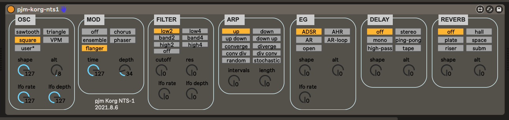

pjm-korg-nts1 - Max for Live device for the Korg NTS-1
--------------------------------------------------------------------------------

This is a Max for Live MIDI Effect device. It is used to control the 
[Korg NTS-1][] Programmable Synthesizer Kit.  Here's a [nice video][] on this
device from Loopop

[Korg NTS-1]: https://www.korg.com/us/products/dj/nts_1/
[nice video]: https://www.youtube.com/watch?v=Vhonu-rM0B0&ab_channel=loopop

usage
================================================================================

Since this is a Max for Live MIDI Effect device, it needs to be added to a MIDI
track. That MIDI track will need to have it's output set to go to the NTS-1
MIDI port. I suggest creating a new track NTS-1 with this device in it, and a
MIDI Monitor device before and after it, disabled, but ready to help out for
debugging if needed.

You can also set the input MIDI port to the same NTS-1 MIDI port, in which case
any changes you make to the NTS-1 on the device itself, will be reflected back
in this UI, and then saved in your Live Set.

The auto-mapped parameters for the device are set up as the following banks
(each row is a bank):

| control 1   | control 2     | control 3    | control 4   | control 5     | control 6   | control 7     | control 8  |   
|-------------|---------------|--------------|-------------|---------------|-------------|---------------|-------------
| osc-type    | osc-shape     | osc-alt      | lfo-rate    | lfo-depth     | mod-type    | mod-time      | mod-depth  |
| filter-type | filter-cutoff | filter-res   | sweep-rate  | sweep-depth   | arp-type    | arp-intervals | arp-length |
| eg-type     | eg-attack     | eg-release   | trem-rate   | trem-depth    |             |               |            |     
| delay-type  | delay-time    | delay-depth  | delay-mix   | reverb-type   | reverb-time | reverb-depth  | reverb-mix | 

references
================================================================================

- Korg NTS-1 manuals, including the critical **MIDI Implementation Chart**:

  https://www.korg.com/us/support/download/product/0/832/#manual

additional MIDI details for factory setup
================================================================================

### osc-type - cc 53

| type     | cc value |   
|----------|----------------|    
| sawtooth |        0 -  24 | 
| triangle |       25 -  49 | 
| square   |       50 -  74 | 
| VPM      |       75 -  99 | 
| user*    |      100 - 127 | 

### filter-type - cc 42

| type     | cc value       |   
|----------|----------------|    
| low 2    |        0 - ... | 
| low 4    |       18 - ... | 
| band 2   |       36 - ... | 
| band 4   |       54 - ... | 
| high 2   |       72 - ... | 
| high 4   |       90 - ... | 
| off      |      108 - 127 |

### eq-type - cc 14

| type    | cc value       |   
|---------|----------------|    
| ADSR    |        0 - ... | 
| AHR     |       25 - ... | 
| AR      |       50 - ... | 
| AR loop |       75 - ... | 
| open    |      100 - 127 | 

### arp-type - cc 117

| type       | cc value       |   
|------------|----------------|    
| up         |        0 - ... | 
| down       |       12 - ... | 
| up down    |       24 - ... | 
| down up    |       36 - ... | 
| converge   |       48 - ... | 
| diverge    |       60 - ... | 
| conv div   |       72 - ... | 
| div conv   |       84 - ... | 
| random     |       96 - ... | 
| stochastic |      108 - 127 | 

### mod-type - cc 88

| type     | cc value       |   
|----------|----------------|    
| off      |        0 - ... | 
| chorus   |       25 - ... | 
| ensemble |       50 - ... | 
| phaser   |       75 - ... | 
| flanger  |      100 - 127 | 
 
### delay-type - cc 89

| type      | cc value       |   
|-----------|----------------|    
| off       |        0 - ... | 
| stereo    |       21 - ... | 
| mono      |       42 - ... | 
| ping pong |       63 - ... | 
| high pass |       84 - ... | 
| tape      |      105 - 127 | 
 
### reverb-type - cc 90

| type      | cc value       |   
|-----------|----------------|    
| off       |        0 - ... | 
| hall      |       21 - ... | 
| plate     |       42 - ... | 
| space     |       63 - ... | 
| riser     |       84 - ... | 
| submarine |      105 - 127 | 
 

changelog
================================================================================

version 2021.8.6

- OSC controls working, but nothing else
- UI layout seems done-ish, will need tweaks I'm sure
- wire up the back-end
- can it be made narrower?

version 2021.7.10

- initial version
